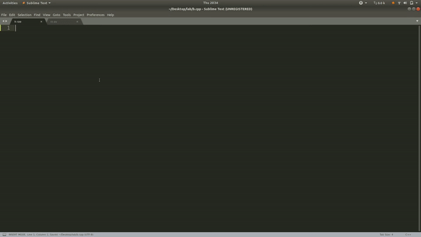

Place this directory in :

```/home/harsh/.config/sublime-text-3/Packages/User/```
repalce ```harsh``` with your ```username``` and type ```init, Debug, Number``` in any cpp file and hit enter to see magic. Note these work only with cpp files due to ```<scope> .... </scope> ``` line in each snippet.

Alternatively you can go to ```Preferences -> Browse Packages -> User```
(I hope a directory named ```User``` exists there)

### Demo:
